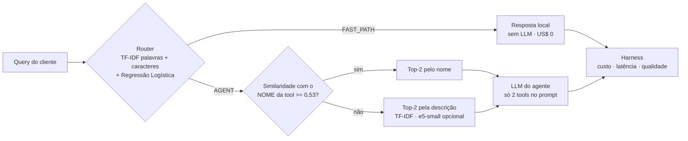
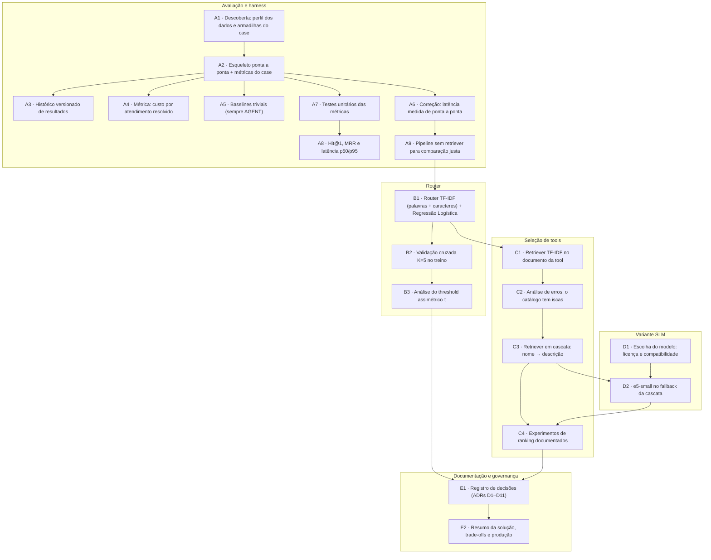

# Kanban — Router de Queries & Seleção de Tools

> Gerado por `python docs/sync_kanban.py` a partir de [`docs/kanban.html`](docs/kanban.html) (versão visual; abra no navegador). Não edite à mão.

**20 entregues · 6 testadas e descartadas · 8 no backlog · 5 frentes de trabalho**

## Arquitetura final

## Melhoria contínua: uma mudança por versão

| Versão | O que mudou | Acurácia router | Hit@1 retriever | Economia de custo | Resolução | Erros graves |
|---|---|---|---|---|---|---|
| v00.3 | Controle: sempre AGENT, sem retriever (= baseline) | 66,7% | — | 0,0% | 100% | 0 |
| v01.4 | Router aleatório, sem retriever | 76,7%* | — | 30,0% | 90,0% | 3 |
| v02 | Router TF-IDF + Reg. Logística, sem retriever | 100% | — | 33,3% | 100% | 0 |
| v03 | + retriever TF-IDF no documento da tool | 100% | 5% | 77,8% | 36,7% | 0 |
| **v04** (solução) | + retriever em cascata nome → descrição | 100% | 20% | 77,8% | 46,7% | 0 |
| v05 | Cascata com e5-small no fallback (variante) | 100% | 15% | 77,8% | 43,3% | 0 |

\* A seed do router aleatório foi o máximo de 1.000 seeds (média 49,9%).

## Frentes de trabalho

### A · Avaliação e harness (9/11)

*Eng. de avaliação / MLOps* — Régua confiável antes de otimizar: métricas corretas, testadas e versionadas.

**Feito**

- [x] **A1** Descoberta: perfil dos dados e armadilhas do case — Lista de armadilhas que guiou todas as frentes
- [x] **A2** Esqueleto ponta a ponta + métricas do case — Fluxo completo rodando desde o primeiro dia · `78f7936 · PR #1`
- [x] **A3** Histórico versionado de resultados — historico.csv com todas as versões · `8df5304`
- [x] **A4** Métrica: custo por atendimento resolvido — Aleatório: 76,7% de economia, mas 17% mais caro por cliente resolvido · `3c3ee13`
- [x] **A5** Baselines triviais (sempre AGENT) — 66,7% de acurácia sem nenhum modelo · `8c00955`
- [x] **A6** Correção: latência medida de ponta a ponta — Economia de latência: 99,9% (enganoso) → 60,6% · `02f9eaa · PR #3`
- [x] **A7** Testes unitários das métricas — 15 testes passando no total · `b495d67 · PR #4`
- [x] **A8** Hit@1, MRR e latência p50/p95 — Oráculo com gabarito em 2º lugar: P@2 = 100%, Hit@1 = 0% · `73f4018 · 2859090 · PR #5`
- [x] **A9** Pipeline sem retriever para comparação justa — Controle = baseline: 0,0% de economia de custo · `999f042 · PR #6`

**Backlog (próximos passos)**

- [ ] **N1** Eval maior, rotulado a partir de produção — Hoje: 30 queries, 1 query = 3–5 pp
- [ ] **N2** Penalidade por cliente não atendido na métrica — Sem ela, a métrica premia o barato que erra

### B · Router (3/4)

*Eng. de ML* — Decidir FAST_PATH vs AGENT barato, rápido e explicável.

**Feito**

- [x] **B1** Router TF-IDF (palavras + caracteres) + Regressão Logística — v02: 100% no eval, 0 erros graves · `385a63b · PR #6`
- [x] **B2** Validação cruzada K=5 no treino — ~90% ± 9% de acurácia: estimativa honesta de generalização · `138d982 · PR #6`
- [x] **B3** Análise do threshold assimétrico τ — τ=0,7 corta ~80% dos erros graves; vale se 1 cliente não atendido custar > ~US$ 0,32 · `bad63c0 · PR #7`

**Testado e descartado**

- ✖ **X1** Adotar τ = 0,7 agora — Virou decisão de negócio (backlog) · `bad63c0`

**Backlog (próximos passos)**

- [ ] **N3** Calibrar τ com o negócio — Análise pronta (B3)

### C · Seleção de tools (4/7)

*Eng. de ML / busca* — Top-2 tools certas entre 285, sem LLM.

**Feito**

- [x] **C1** Retriever TF-IDF no documento da tool — v03: Hit@1 5%, P@2 25% · `07af934 · PR #8`
- [x] **C2** Análise de erros: o catálogo tem iscas — 16 dos 16 erros de top-1: isca na mesma categoria do gabarito
- [x] **C3** Retriever em cascata: nome → descrição — v04: Hit@1 5% → 20%, resolução 36,7% → 46,7% · `8475d09 · PR #8`
- [x] **C4** Experimentos de ranking documentados — Nenhuma supera a cascata no top-1 · `56a01d9 · PR #9`

**Testado e descartado**

- ✖ **X2** Filtro por categoria na cascata — Corrige 0 de 16 erros (teto zero)
- ✖ **X3** BM25 e TF-IDF sublinear — Cascata com BM25: Hit@1 15% (v04: 20%) · `56a01d9`
- ✖ **X4** Aumentar k para 3 — Hit@3 = 65% vs Hit@2 = 25% (v03); fica como recomendação para LLM real
- ✖ **X5** Posição da tool no catálogo como sinal — Não testado por princípio

**Backlog (próximos passos)**

- [ ] **N4** Governança do catálogo de tools — Maior ganho disponível: o limite é o catálogo
- [ ] **N5** LLM real escolhendo entre as top-3 — Gabarito nas top-3 em 65% (v03)
- [ ] **N6** Roteamento hierárquico para milhares de tools — Teto zero no case, útil em escala

### D · Variante SLM (2/3)

*Eng. de ML* — Testar se um encoder semântico pequeno supera o clássico.

**Feito**

- [x] **D1** Escolha do modelo: licença e compatibilidade — Dependência opcional em requirements-slm.txt · `b1e5f87`
- [x] **D2** e5-small no fallback da cascata — v05: Hit@1 15% (v04: 20%), ~9× a latência do retriever · `b1e5f87 · 7cfbbc1 · PR #8`

**Testado e descartado**

- ✖ **X6** e5-small como solução principal — Critério prévio: SLM só se ganhar de forma mensurável · `7cfbbc1`

**Backlog (próximos passos)**

- [ ] **N7** Comparar Colibri (pt-BR) no mesmo eval

### E · Documentação e governança (2/3)

*Time todo* — Decisões rastreáveis, trade-offs e caminho para produção.

**Feito**

- [x] **E1** Registro de decisões (ADRs D1–D11) — docs/DECISIONS.md · `07204fc · PR #10`
- [x] **E2** Resumo da solução, trade-offs e produção — SOLUCAO.md · `7e04fcf · PR #11`

**Backlog (próximos passos)**

- [ ] **N8** Produção: deploy, observabilidade e guardrails — Detalhado em SOLUCAO.md

## Dependências entre tarefas entregues

